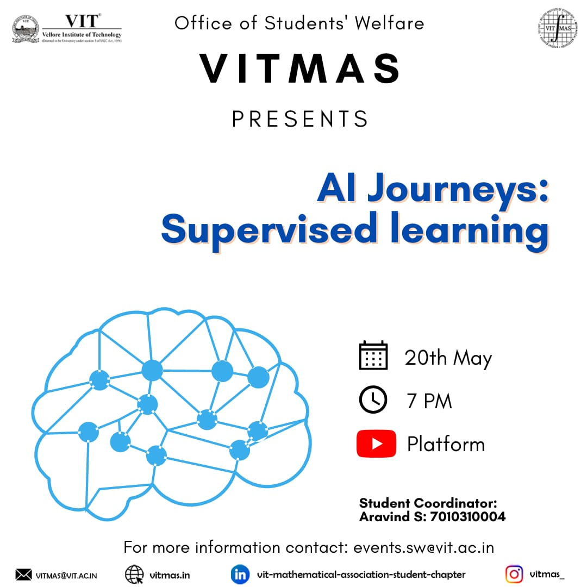

# AI-Journeys-Supervised-Learning
  
" The smarter the humans get, the lesser their brains have to work"  
  
There's hardly any field booming with as much exuberance as Artificial intelligence and machine learning lately, and for a good reason at that because the smarter humans get, the closer humanity comes at mimicking the vast intricacies of the mind.  
  
Join VITMAS at this celebration of knowledge, at "AI JOURNEYS" where we screw to open the mind of a machine for you and gain a better understanding of it through this "mind-opening" experience.

<h3>Youtube video Link:</h3><a href="https://www.youtube.com/watch?v=9_SEplBI7c8">AI Journeys : Supervised Learning</a>
